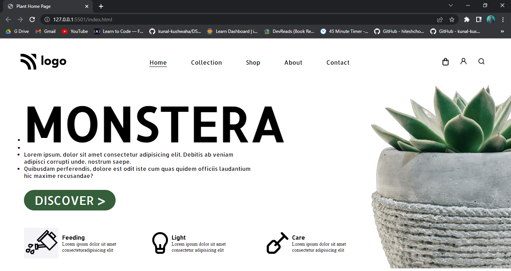

# Plant Home Page

Hi 👋 I am Shobhan Sundar Goutam. This project is made with the help of `HTML` and `CSS`.

 

### Screenshot

- ### Learnings from this project:-

  - Learned to use a lot about CSS Selectors.
  - Learned about the property `text-underline-offset`.
  - Learned to use flexbox.

- It took around _5 hours_ to complete.

- Live Link:- [Plant Home Page](https://plant-fsjs6.netlify.app/)
